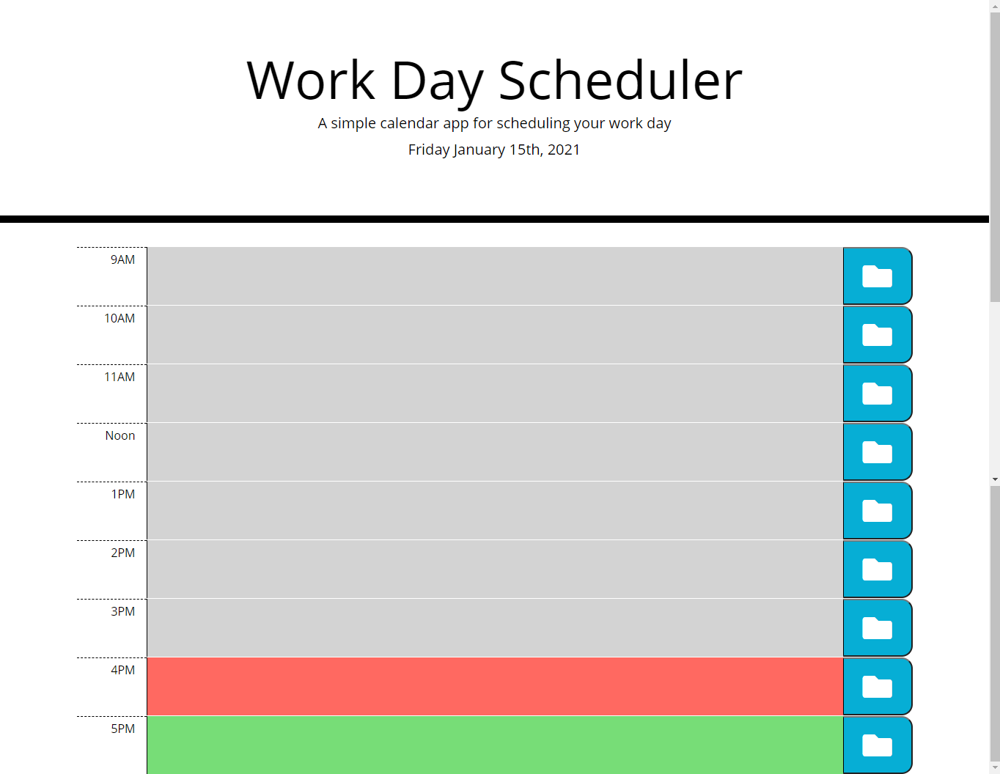

# Work Day Scheduler
This was the week 5 challenge from the University of Toronto School of Contiued Studies. Third Party API's challenge required me to create a day planner. The current date should be at the top of the planner. The work day planner should be color coded to the current time, red is the current hour, grey is the past and green is the future. The user can click a time slot and enter in thier information and click the save icon and the information is saved in local storage. I recevied a mark of 100% and included a setInterval to ensure the page does nto have to be refreshed to see the current color time block.

## Live Website
 https://jshallcross.github.io/work-day-scheduler

 ## Technologies Used
 HTML / CSS / JavScript / Jquery

## Tutor Thanks
Tutor (Sean) helped me sort out an issue with my local storage not displaying

## Additions
Added a setInterval to make sure time blocks stay the correct colour without having user refresh the page

## Screenshot

